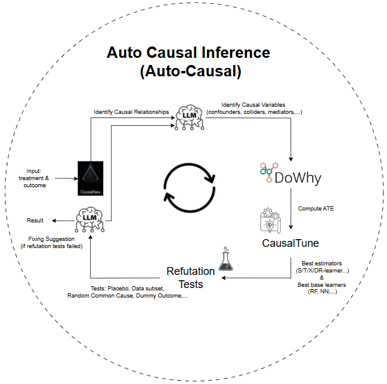

# Auto Causal Inference for Banking

## 🗂️ Notes about Version Changes
- `v1.1 (current version)`: integrate **CausalNex**, **CausalTune**, **Refutation Test**,... to make Auto-Causal more roburst
- `v1.0` ([link](https://github.com/lethienhoavn/auto-causal-inference/tree/e8790d0468d93e1c904ade457cacbbb7159994d5)): rely on the strong semantic understanding & reasoning capability of **LLM** to identify entire causal structure (causal relationships, causal variables,...) on the fly

## 💡Motivation

One of the most challenging aspects of **causal inference** is not running the estimation algorithm, but **correctly identifying the causal roles of variables** in the system — such as **confounders**, **mediators**, **colliders**, **effect modifiers**, and **instruments**.

This task typically requires domain expertise and experience, because:

* Simply adding **more variables** to the model does **not guarantee better causal estimates** — in fact, it can **bias** the results if colliders or mediators are adjusted incorrectly.
* Traditional approaches often rely on **manual DAG construction** and careful pre-analysis.

> ✅ **Auto Causal Inference (Auto-Causal)** was created to solve this problem using **LLMs (Large Language Models)** — allowing users to specify only the **treatment** and **outcome**, and automatically infer variable roles and a suggested causal graph.

This enables:

* Faster experimentation with causal questions
* Automatically selecting the right confounding variables for the analysis
* Lower reliance on domain-specific manual DAGs
* More transparency and reproducibility in the inference process


## 🧠 How Auto-Causal Works:

This project demonstrates an automated Causal Inference pipeline for banking use cases, where users only need to specify:

- a `treatment` variable
- an `outcome` variable

The app will automatically perform these steps:
- Search relevant variables in the database
- Find causal relationships with CausalNex
- Identify causal variables
- Perform Causal Model with DoWhy
- Seek for the best estimators & base learners with CausalTune
- Run refutation test to check the causal structure
- Propose fixing solutions if refutation tests do not pass (and make re-run loop)

<div align="center">

</div>


## 💼 Example use cases

| Scenario                                      | Treatment         | Outcome              |
|-----------------------------------------------|--------------------|-----------------------|
| Does promotion offer increase IB activation? | `promotion_offer` | `activated_ib`       |
| Do branch visits increase engagement?        | `branch_visits`   | `customer_engagement`|
| Does education level affect income?          | `education`       | `income`              |
| Does channel preference affect IB usage?     | `channel_preference` | `activated_ib`    |

### Lists of Variables for Analysis:

| Variable              | Description                                                                                                         |
| --------------------- | ----------------------------------------------------------------------------------------------- |
| `age`                 | Customer age | 
| `income`              | Customer income level  | 
| `education`           | Education level of customer                                | 
| `branch_visits`       | Number of times the customer visited a physical branch in a time window                                            | 
| `channel_preference`  | Preferred communication or service channels (e.g., online, phone, in-branch)                                       | 
| `customer_engagement` | Composite metric reflecting interactions, logins, responses to comms, etc                                          |
| `region_code`         | Geographic region identifier                           | 
| `promotion_offer`     | Binary variable: whether the customer received a promotion                              | 
| `activated_ib`        | Binary outcome: whether the customer activated Internet Banking                 |


## Project Description

This project features two different agent architectures for running causal inference workflows:

- **LangGraph Agent:** Implements the analysis as a graph of tasks (nodes) executed synchronously or asynchronously, orchestrated in a single process.
- **MCP Agent:** Splits each task into independent MVP servers communicating via HTTP following the Model-Context-Protocol (MCP) pattern, enabling easy scaling and modular service deployment.


## Project Structure

```
auto_causal_inference/
├── agent/                 # LangGraph agent source code
│   ├── data/              # Sample data (bank.db)
│   ├── app.py             # Main entry point for LangGraph causal agent
│   ├── generate_data.py   # Data generation script for causal inference
│   ├── requirements.txt   # Dependencies for LangGraph agent
│   └── ...                # Other helper modules and notebooks
│
├── mcp_agent/             # MCP agent implementation
│   ├── data/              # Sample data (bank.db)
│   ├── server.py          # MCP causal inference server
│   ├── client.py          # MCP client to call the causal inference server
│   ├── requirements.txt   # Dependencies for MCP agent
│   └── ...                # Additional files
│
└── README.md              # This documentation file
````


## 📦 Requirements


- Python 3.10
- Claude Desktop (to run MCP)
- Install dependencies:

```bash
pip install requirements.txt
````

## ▶️ How to Run

### a. Run LangGraph
```bash
cd agent
python app.py
```

To test with LangGraph Studio
```bash
langgraph dev
```

UI Address is available at: https://smith.langchain.com/studio/?baseUrl=http://127.0.0.1:2024

### b. Run MCP with Claude Desktop
```bash
cd mcp_agent
python client.py
```


## 🧪 Input

```
User asks: "Does offering a promotion increase digital product activation ?"
```

## 📤 Output

### Causal Relationships

```
age -> promotion_offer;
age -> activated_ib;
income -> promotion_offer;
income -> activated_ib;
education -> promotion_offer;
education -> activated_ib;

region_code -> promotion_offer;

promotion_offer -> branch_visits;
branch_visits -> activated_ib;

promotion_offer -> customer_engagement;
activated_ib -> customer_engagement;

channel_preference -> activated_ib;
promotion_offer -> activated_ib
```

### Causal Variables

```json
{
  "confounders": ["age", "income", "education"],
  "mediators": ["branch_visits"],
  "effect_modifiers": ["channel_preference"],
  "colliders": ["customer_engagement"],
  "instruments": ["region_code"],
  "causal_graph": "...DOT format...",
  "dowhy_code": "...Python code..."
}
```

### Compute Average Treatment Effect (ATE)

```python
import dowhy
from dowhy import CausalModel

model = CausalModel(
    data=df,
    treatment='promotion_offer',
    outcome='activated_ib',
    common_causes=['age', 'income', 'education'],
    instruments=['region_code'],
    mediators=['branch_visits']
)

identified_model = model.identify_effect()
estimate = model.estimate_effect(identified_model, method_name='backdoor.propensity_score_matching')
print(estimate)
```

### Model Tuning

```python
estimators = ["S-learner", "T-learner", "X-learner"]
# base_learners = ["random_forest", "neural_network"]

cd = CausalityDataset(data=df, treatment=state['treatment'], outcomes=[state["outcome"]],
                    common_causes=state['confounders'])
cd.preprocess_dataset()

estimators = ["SLearner", "TLearner"]
# base_learners = ["random_forest", "neural_network"]

ct = CausalTune(
    estimator_list=estimators,
    metric="energy_distance",
    verbose=1,
    components_time_budget=10, # in seconds trial for each model
    outcome_model="auto",
)

# run causaltune
ct.fit(data=cd, outcome=cd.outcomes[0])

print(f"Best estimator: {ct.best_estimator}")
print(f"Best score: {ct.best_score}")
```

### Refutation Test

```python
refute_results = []
refute_methods = [
    "placebo_treatment_refuter",
    "random_common_cause",
    "data_subset_refuter"
]
for method in refute_methods:
    refute = model.refute_estimate(identified_estimand, estimate, method_name=method)
    refute_results.append({"method": method, "result": str(refute)})

pass_test = all("fail" not in r["result"].lower() for r in refute_results)
```

### Result Analysis:

```
| Role                | Variable                     | Why it's assigned this role                                      |
| ------------------- | ---------------------------- | ---------------------------------------------------------------- |
| **Confounder**      | `age`, `income`, `education` | Affect both the chance of receiving promotions and IB usage.     |
| **Mediator**        | `branch_visits`              | A step in the causal path: promotion → visit → IB activation.    |
| **Effect Modifier** | `channel_preference`         | Alters the strength of the effect of promotion on IB activation. |
| **Collider**        | `customer_engagement`        | Affected by both promotion and IB usage; should not be adjusted. |
| **Instrument**      | `region_code`                | Randomized promotion assignment at the regional level.           |


Best estimator: backdoor.econml.metalearners.TLearner, score: 483.1930697900207


Refutation passed: True.
[   
    {'method': 'placebo_treatment_refuter', 
    'result': 'Refute: Use a Placebo Treatment Estimated effect:0.23849549989874572
                New effect:-0.0004960408910311281
                p value:0.96'}, 
    {'method': 'random_common_cause', 
    'result': 'Refute: Add a random common cause
                Estimated effect:0.23849549989874572
                New effect:0.23847067700750038
                p value:0.98'}, 
    {'method': 'data_subset_refuter', 
    'result': 'Refute: Use a subset of data
                Estimated effect:0.23849549989874572
                New effect:0.23749715031525756
                p value:0.96'}
]


Result Summary:
1. There is a causal effect between offering promotions and activating internet banking services, with a 15% increase of activating internet banking if we open the promotion for everybody. This shows a strong positive impact of the promotion offer on activation.

2. Factors like age, income, education level could have influenced both the decision to offer promotions and the likelihood of activating internet banking services. These factors may have affected the outcome regardless of the promotion offer.
```

## 🛠️ Comparison with other Tools / Methods

| 📝 **Criteria**          | 🔍 **CausalNex**            | ⚖️ **DoWhy**                | 🤖 **CausalTune**       | 🚀 **Auto Causal Inference**            |
| ------------------------ | --------------------------- | --------------------------- | ----------------------- | ----------------------------------------------------- |
| 🎯 **Main purpose**      | Causal graph learning       | Full causal pipeline        | Auto estimator tuning   | Auto causal Q\&A: discovery → estimation → tuning     |
| 🔎 **Discovery**         | Yes (NOTEARS, Hill Climb)   | Yes (PC, NOTEARS, LiNGAM)   | No                      | Yes (CausalNex + DoWhy discovery)                     |
| 🧩 **Confounder ID**     | No                          | Yes                         | No                      | Yes (LLM analyzes graph to ID confounders)            |
| 📊 **Estimation**        | Limited (Bayesian Nets)     | Rich estimators             | Yes (many learners)     | Yes (DoWhy estimates ATE)                             |
| ⚙️ **Auto estimator**    | No                          | No                          | Yes                     | Yes (CausalTune auto selects best estimator)          |
| ✅ **Refutation**         | No                          | Yes                         | No                      | Yes (DoWhy refutation tests)                          |
| 👤 **User input needed** | Manual graph & methods      | Manual estimator            | Select estimator        | Just ask treatment → outcome question                 |
| 🤖 **Automation level**  | Low to medium               | Medium                      | High                    | Very high                                             |
| 📥 **Input data**        | Observational tabular       | Observational + graph       | Observational + model   | Observational + DB metadata                           |
| 🔄 **Flexibility**       | High structure learning     | High inference & refutation | High tuning             | Very high, combines many tools + LLM                  |
| 🎯 **Best for**          | Researchers building graphs | Pipeline users              | ML production tuning    | Business users wanting quick causal answers           |
| 💪 **Strength**          | Good causal graph learning  | Full causal workflow        | Auto estimator tuning   | End-to-end automation + LLM support                   |
| ⚠️ **Limitations**       | No built-in validation      | No auto tuning              | No discovery/refutation | Depends on data quality, manual check if refute fails |